# School District Analysis
## Overview 
In this project we were asked by a school district to find the average grades in math and reading for student performance from multilple schools and grade years.
## Purpose 
The purpose of this analysis was to present the metrics for each school in table format so the district can better understand the performance of each school. With our table formatting the district can now easily compare performance between each school by:
- The average math score received by students in each grade level 
- The average reading score received by students in each grade level
- School performance based on the budget per student
- School performance based on the school size 
- School performance based on the type of school

The district will also be provided a DataFrame of each schools perfomanced based on overall passing rate to see the top performing schools vs the bottom performing schools.

## Analysis of Results
In the challenge assignment we removed the math and reading scores of the ninth graders from Thomas High School. In this analysis we will compare how the removal of these scores affected the results of the:
- District Summary 
- School Summary
- Math and reading scores by grade
- Scores by spending 
- Scores by school size 
- Scores by school type

### Dsitrict Summary
Module District Summary
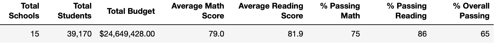
Challenge District Summary
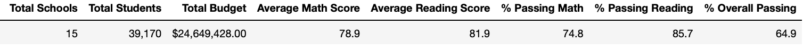

When comparing the district summaries we can see that in the Challenge District Summary the Average Math Score, % Passing Math, % Passing Reading, and % Overall Passing have all gone down by a small margin. This change could mean that the ninth graders were actually helping the passing percentages for math and reading at the district level.

### School Summary
Module School Summary
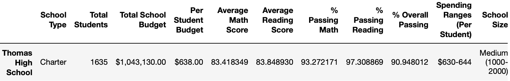
Challenege School Summary
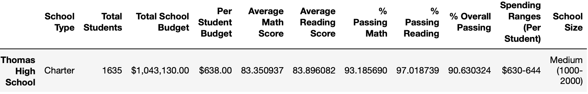

When comparing the school summaries we can see that in the Challenge School Summary the Average Math Score, % Passing Math, % Passing Reading, and % Overall Passing have all gone down by a small margin. This change could mean that the ninth graders were actually helping the passing percentages for math and reading at the Thomas High School level. 

By removing the ninth graders' math and reading scores, Thomas High School performance does drop, however, remains the same compared to other schools when sorting them in descending order Thomas High School remains the second best performing school.
```
sorted_df = per_school_summary_df.sort_values(["% Overall Passing"], ascending=False)
sorted_df
```
School Summary by % Overall Passing Decending Order with Ninth Graders 
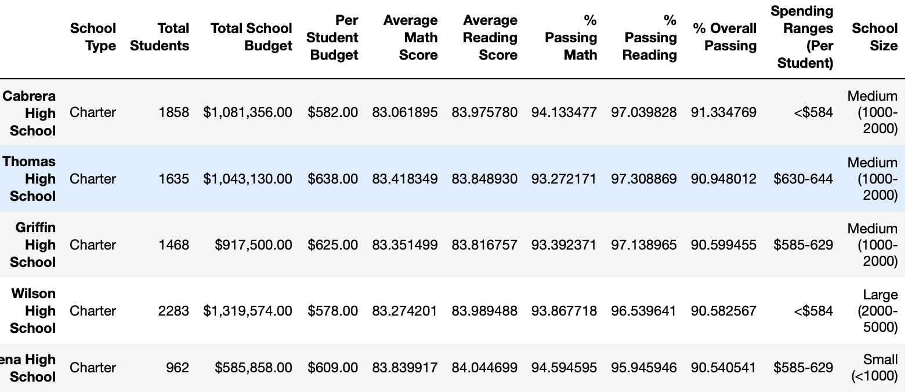
School Summary by % Overall Passing Decending Order without Ninth Graders
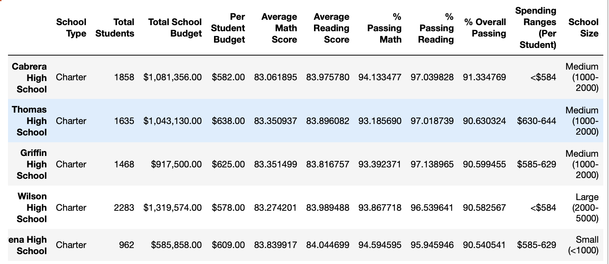

- Math and reading score by grade remain the same except for row "Thomas High School" column "9th" will read "nan".

## Scores for Math by Grade
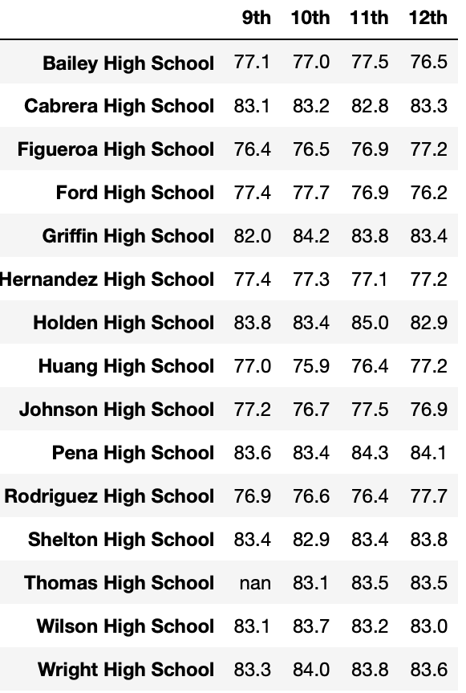

## Scores for Reading by Grade
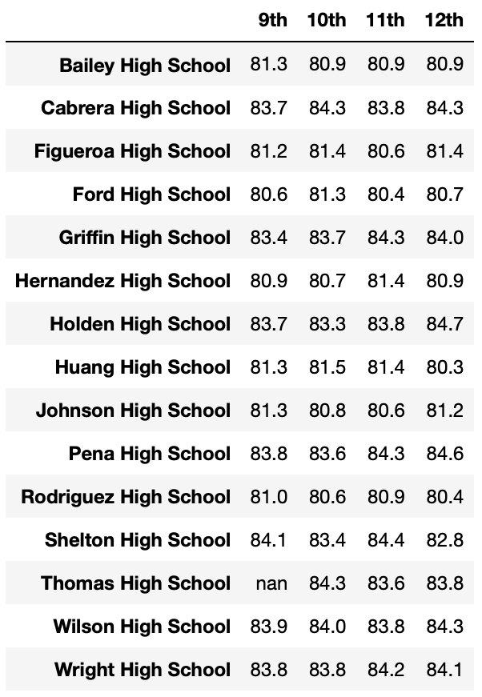

- Scores by school spending decreased in the $630-644 range for Average Math Score, % Passing Math % Passing Reading and % Overall Passing. Average Reading Score increased. However this change is so small that when formatted with or without 9th graders' scores spending summary read the same.

Spending Summary with Ninth Graders
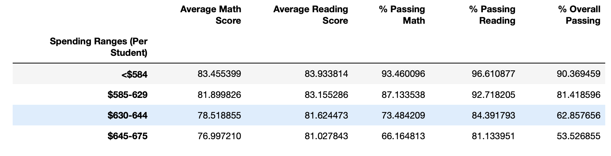
Spending Summary without Ninth Graders
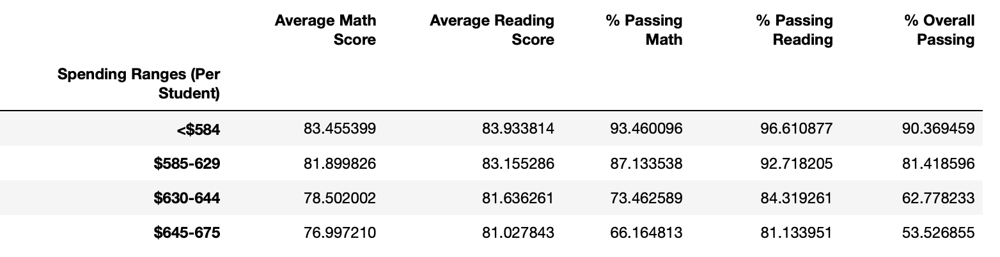
Spending Summary Formatted
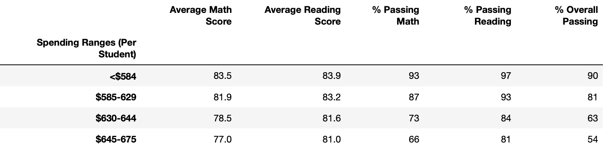

- Scores by school size for the range "Medium (1000-2000)" decreased by a very small amount. However, after formatting they read the same results.
Scores by Size with Ninth Graders
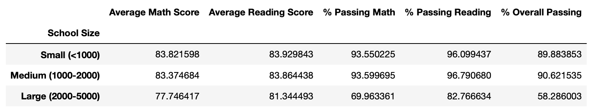
Scores by Size without Ninth Graders
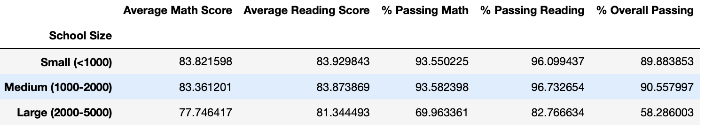
Scores by Size Formatted
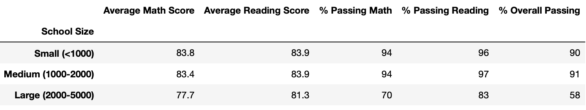

- Scores by school type "Charter" decreased by a small amount. However, after formatting they read the same results.
Scores by Type with Ninth Graders
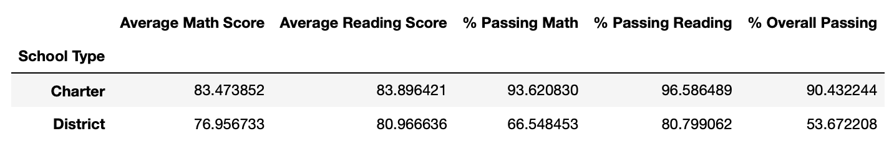
Scores by Type without Ninth Graders
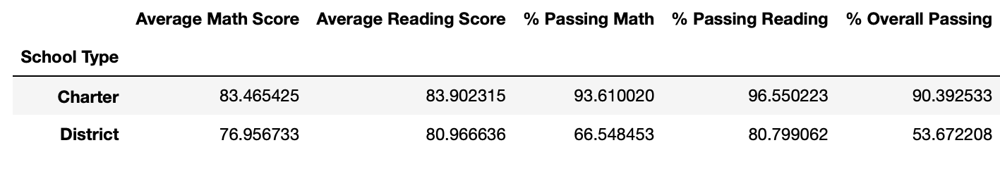
Scores by Type Formatted
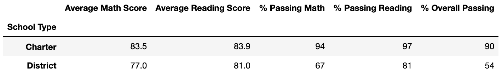

## Summary
Four changes in the updated School District Analysis are:

1. All the passing percentages went down by very small margins.

2. In the spending DataFrame the schools with spending range "$630-644" averages and percentages were the only ones to decrease.

2. In the school size DataFrame the medium range schools' averages and percentages were the only ones to decrease.

3. In the school type DataFrame the Charter Schools' avereges and percentages were the only ones to decrease.

